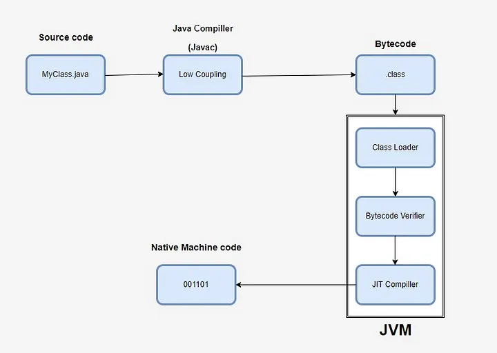
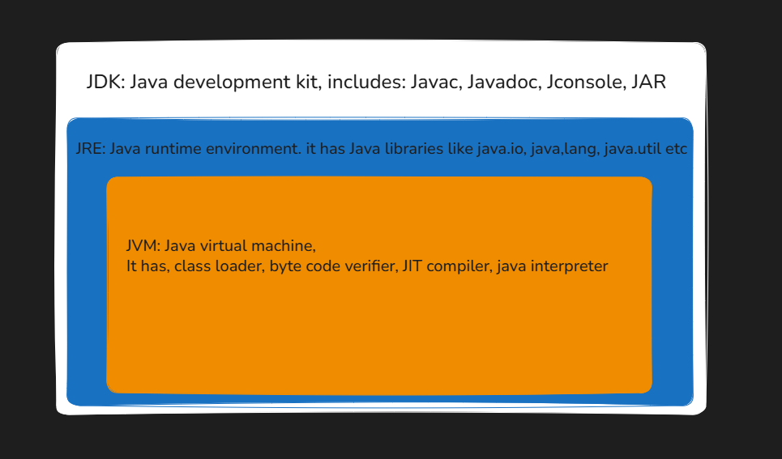

### Anatomy
1. Java is high-level programming language
2. Java is not a completely object-oriented programming language because it has the support of primitive data types like int, float, char, boolean, double, etc.
3. Java adheres to **“write once, run anywhere” philosophy**. You write code in `.java` file and with help of compiler (javac) you compile it to `.class` file (which is basically bytecode). 
4. Now you can feed this .class to any JVM. (Note that **jvm is platform dependent**, whereas when the `.class` **(Bytecode) is platform independent**, Hence the philosophy “write once, run anywhere”).

*Source: [@alxkm/how-compilation-works-in-java](https://medium.com/@alxkm/how-compilation-works-in-java-0ac4d1e95b99)*

*Source: [https://stackoverflow.com/a/36394113](https://stackoverflow.com/a/36394113)*

3. Code written in Java is:
    - First compiled to bytecode by a compiler (javac) as shown in the left section of the image above; 
    - Then, as shown in the right section of the above image, another program called java starts the Java runtime environment and it may compile and/or interpret the bytecode by using the Java Interpreter/JIT Compiler.

4. JDK, JRE, JVM:

5. Java compilation types 
    - Ahead-of-Time (AOT) Compilation
        - Converts Java bytecode to native machine code before runtime.
        - Faster startup, smaller memory footprint.
        - Request hits the app → Code already compiled → Immediate execution.
    - Just-In-Time (JIT) Compilation
        - Compiles bytecode to native code at runtime, during execution.
        - Slower startup due to compilation overhead.
        - Request hits app → JVM interprets bytecode → Hot methods (frequently used) compiled on-the-fly → Faster later execution.
    - Synchronous Compilation
        - JIT compiles code inline during execution.
        - Request thread blocks during compilation.
        - Request hits hot code → Thread pauses → Method compiled → Then executed.
    - Asynchronous Compilation
        - JIT compiles in a background thread.
        - No pause in main request flow.
        - Request hits hot code → Executes interpreted version → JIT compiles in background → Future requests use compiled code.

Good read: https://medium.com/@alxkm/how-compilation-works-in-java-0ac4d1e95b99

---

### Rules:
- When a Java file is compiled, the compiler creates a separate .class file for each class defined within it.
- The name of the .java file must match the name of the public class
- A source file can have only one public class. But why? [During execution, the Java Virtual Machine (JVM) starts by looking for the main method within a public class. If multiple public classes were allowed, it would create ambiguity as to which class should be the entry point of the program. By restricting it to one public class, the JVM can easily identify where to begin execution.]

---

### Java Editions Comparison

Java has three main editions that cater to different types of application development:
1. **JSE (Java Standard Edition)**: Core Java programming for desktop and general-purpose applications. 
    - Includes:
        - Core libraries (java.lang, java.util, etc.)
        - JVM, JDK, JRE
        - APIs for I/O, networking, collections, multithreading
        - GUI libraries: Swing, AWT 
2. **JEE (Java Enterprise Edition) (Now Jakarta EE)**: Java for enterprise applications – large-scale, distributed, web-based. Built on top of JSE
    - Includes:
        - JPA (Java Persistence API)
        - Servlets, JSP
        - Transactions
3. **JME (Java Micro Edition)**: Java for small devices with limited resources (IoT, embedded systems, old mobile phones).
    - Includes:
        - Subset of JSE + device-specific APIs

---
