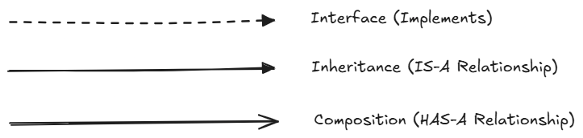

## Unsaid OOP Principles

1. **Favor composition over inheritance**
- It suggests that you should use composition (has-a relationships) to extend behavior rather than inheritance (is-a relationships), whenever possible.
- **Inheritance**: You create a subclass that inherits behavior from a parent class. (**is-a** relationship)
- **Composition**: You build classes by combining other classes. (**has-a** relationship)
> Why? Because composition is more flexible, loosely coupled, and avoids tight dependency on a parent class's internals.
- Problem with **Inheritance**
```Java
class Bird {
    public void fly() {
        System.out.println("Flying in the sky...");
    }
}

class Penguin extends Bird {
    // Penguin inherits fly() — but this is incorrect behavior!
}

public class Zoo {
    public static void main(String[] args) {
        Bird bird = new Penguin();
        bird.fly();  // ❌ Logically wrong — penguins can't fly
    }
}
```
- Why Inheritance Fails Here:
    - Penguin is not logically a bird that can fly.
    - The fly() method from Bird should not be inherited.
    - You’re forced to override or block behaviors that shouldn’t exist.
    - This breaks Liskov Substitution Principle: a subclass should be usable in place of a parent class without breaking correctness.

- **Composition Example (Better Design)**
```Java
// Interface for flying behavior
interface FlyBehavior {
    void fly();
}

// Different fly behaviors
class CanFly implements FlyBehavior {
    public void fly() {
        System.out.println("Flying in the sky...");
    }
}

class CannotFly implements FlyBehavior {
    public void fly() {
        System.out.println("I can't fly.");
    }
}

// Base Bird class
class Bird {
    private FlyBehavior flyBehavior;

    public Bird(FlyBehavior flyBehavior) {
        this.flyBehavior = flyBehavior;
    }

    public void performFly() {
        flyBehavior.fly();
    }

    public void setFlyBehavior(FlyBehavior fb) {
        this.flyBehavior = fb;
    }
}

// Now different birds can have different behaviors
class Sparrow extends Bird {
    public Sparrow() {
        super(new CanFly());
    }
}

class Penguin extends Bird {
    public Penguin() {
        super(new CannotFly());
    }
}

public class Zoo {
    public static void main(String[] args) {
        Bird sparrow = new Sparrow();
        Bird penguin = new Penguin();

        sparrow.performFly();   // ✅ Flying in the sky...
        penguin.performFly();   // ✅ I can't fly.
    }
}
```
- **Summary**
    - Use inheritance only when the subclass truly "is-a" parent.
    - Favor composition to keep code modular, testable, and flexible.
    - Use design patterns like Strategy, Decorator, and Adapter, which rely on composition.

---

2. **Program to a supertype**
- Declare your variables, parameters, and return types using abstract types (like an interface or an abstract class).
- Instantiate them with concrete subclasses, but write your code only against the supertype.
- Why do this?
    - You can easily switch implementations without changing the rest of your code
    - The calling code does not care what the actual implementation is — it just trusts the contract defined by the abstract class
- **Bad:**
```Java
ArrayList<String> list = new ArrayList<>();
```
- **Good:**
```Java
List<String> list = new ArrayList<>();
```
- You code to the List interface, not the concrete ArrayList
- Later, you can switch to LinkedList, CopyOnWriteArrayList, etc., without breaking the rest of your code.

---

3. **Strive for loosely coupled design between objects that interact**
- Loose coupling means that objects know as little as possible about each other, and they interact through abstractions (interfaces or superclasses) rather than concrete implementations.
- Promotes separation of concerns.
- Each object only needs to know:
    - What another object can do (via an interface or abstract class),
    - Not how it does it.
```Java
public interface NotificationService {
    void send(String message);
}

public class EmailService implements NotificationService {
    public void send(String message) {
        System.out.println("Sending email: " + message);
    }
}

public class SMSService implements NotificationService {
    public void send(String message) {
        System.out.println("Sending SMS: " + message);
    }
}

public class NotificationManager {
    private NotificationService service;

    public NotificationManager(NotificationService service) {
        this.service = service;
    }

    public void notifyUser(String msg) {
        service.send(msg);
    }
}

public class App {
    public static void main(String[] args) {
        NotificationService emailService = new EmailService(); // or new SMSService();
        NotificationManager manager = new NotificationManager(emailService);
        manager.notifyUser("Your order has been shipped.");
    }
}

```
- NotificationManager does not know whether it’s sending an email, SMS, or push notification.
- It only depends on the interface (NotificationService), not any specific implementation.
- You can add a SlackService or PushNotificationService later, and NotificationManager won’t need to change at all.

---

## UML Arrows
